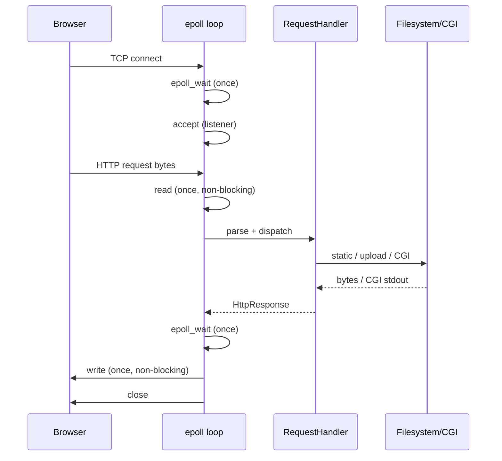

# Architecture

## High-level flow



## Why one `epoll_wait` per loop

Under `siege`, many connections are active. If one hot socket were drained in a tight `read` loop, others would starve. The server therefore:

1. Calls **`epoll_wait` exactly once** per main-loop turn.
2. For each signaled client, performs **at most one** `read` **or** one `write`.
3. Uses **edge-triggered** (`EPOLLET`) registration so the next edge re-arms interest.

## Connection state machine

```
READING ──(full request)──► WRITING ──(all bytes sent)──► CLOSE
   │                           │
   └── timeout / error ────────┴──► remove from epoll
```

## Configuration model

- Each `server { }` block binds `host:port`.
- Multiple blocks on the same `host:port` form a **name-based virtual host list**; the first is default.
- Duplicate `listen` lines log a warning; the first block wins (audit: server keeps running).
- Invalid blocks are skipped; valid blocks still load.

## Security notes (for audit discussion)

- Path resolution uses `safe_join()` — rejects `..` traversal.
- Upload size capped by `client_max_body_size`.
- Session cookies: `HttpOnly`, `SameSite=Lax`.
- CGI runs in a **forked** child with `PR_SET_PDEATHSIG` so orphans die with the server.
